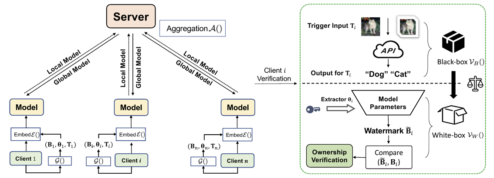

# FedIPR-Repository

[TPAMI 2022](https://ieeexplore.ieee.org/document/9847383) | [ArXiv](https://arxiv.org/abs/2109.13236) | [PDF](https://arxiv.org/pdf/2109.13236.pdf)

### Official pytorch implementation of the paper: 
#### - FedIPR: Ownership Verification for Federated Deep Neural Network Models

Accepted by [TPAMI 2022](https://ieeexplore.ieee.org/document/9847383)

## Description

<p align="justify"> Federated learning models are collaboratively developed upon valuable training data owned by multiple parties. During the
development and deployment of federated models, they are exposed to risks including illegal copying, re-distribution, misuse and/or
free-riding. To address these risks, the ownership verification of federated learning models is a prerequisite that protects federated
learning model intellectual property rights (IPR) i.e., FedIPR. We propose a novel federated deep neural network (FedDNN) ownership
verification scheme that allows private watermarks to be embedded and verified to claim legitimate IPR of FedDNN models. In the
proposed scheme, each client independently verifies the existence of the model watermarks and claims respective ownership of the
federated model without disclosing neither private training data nor private watermark information. </p>



<p align="center"> Figure 1: An illustration of federated DNN (FedDNN) watermark Embedding and Verification scheme. Private watermarks are generated and embedded into the local models, which are then aggregated using the FedAvg algo. (the left panel). In case the federated model is plagiarized, each client may invoke verification processes to extract watermarks from the plagiarized model in both black-box and white-box manner to claim his/her ownership of the federated model (the right panel) </p>

## How to run
python main_fedIPR.py --num_back 10  --num_trigger 10 --num_sign 10 --num_bit 40 --num_users 10 --dataset cifar10 --model_name alexnet --epochs 200 --gpu 0 --local_ep 2 --iid 

## Dataset
The standard CIFAR datasets can be found at [the official site](http://www.cs.toronto.edu/~kriz/cifar.html), 
We provide a trigger dataset at [here](https://drive.google.com/file/d/1E7vFpb4mJAx3oX6zWqvll50b79HdoQHY/view?usp=sharing), you can also generate your own triggers with Projected Gradient Descent algorithm [PGD](https://github.com/cleverhans-lab/cleverhans), or design your own triggers with specific patterns.

## Passport block
Passport block is the layer where we embed our feature based watermarks, the architecture implementation can be found at "models/layers/passportconv2d_private.py".

The specific loss regularization term for feature-based watermark embedding can be found at "models/losses/sign_loss.py"

## How to embed feature-based watermarks into a desired layer

Configs for feature-based watermarks are stored in `configs/`

For example, a layer with 256 channels, so the maximum will be 256-bit === 32 ascii characters are allowed. If the watermark is less than 32 characters, the remaining bits will be set randomly.

The example below is AlexNet with the last 3 layers as the passport layer, i.e we embed random signature into the 4th and 5th layer and embed `this is mine` into the last layer (6th).

```
{
  "0": false,
  "2": false,
  "4": true,
  "5": true,
  "6": "this is mine"
}
```

## Citation
If you find this work useful for your research, please cite
```
@article{li2022fedipr,
  title={FedIPR: Ownership Verification for Federated Deep Neural Network Models},
  author={Li, Bowen and Fan, Lixin and Gu, Hanlin and Li, Jie and Yang, Qiang},
  journal={IEEE Transactions on Pattern Analysis and Machine Intelligence},
  year={2022},
  publisher={IEEE}
}
```
&#169;2022 Webank and Shanghai Jiao Tong University.
